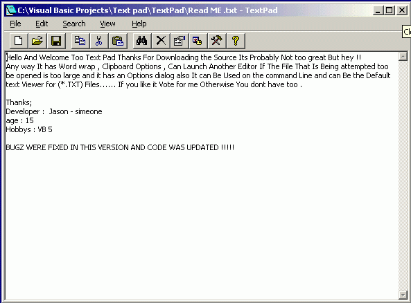



## TextPad FIXED \*\*\*

### Description

My name Is Jason and i Had hoped too create a fully Fledged working text editor and here it is TextPad , It has all these Features and more ;

* Options Dialog

* Full Screen Mode

* Edit , View Clipboard Text

* Text File Manager

* Toolbar

* Wordwrap Feature

* Works On the Command Line

* Can be default Text Viewer (*.TXT)

* If user has Chosen Option, TextPad can Launch An External editor if the file is too large too be opened normally .

* File Properties Dialog

* Find Dialog

* Launch Better Instances User has Choice Through Dialog or Through the Menu.

* Recent File Menu
 
### More Info
 

             |
---                |---
**Submitted On**   |2001-01-07 21:41:04
**By**             |[Jason](https://github.com/Planet-Source-Code/PSCIndex/blob/master/ByAuthor/jason.md)
**Level**          |Intermediate
**User Rating**    |4.3 (13 globes from 3 users)
**Compatibility**  |VB 5\.0, VB 6\.0
**Category**       |[Miscellaneous](https://github.com/Planet-Source-Code/PSCIndex/blob/master/ByCategory/miscellaneous__1-1.md)
**World**          |[Visual Basic](https://github.com/Planet-Source-Code/PSCIndex/blob/master/ByWorld/visual-basic.md)
**Archive File**   |[CODE\_UPLOAD13515172001\.zip](https://github.com/Planet-Source-Code/jason-textpad-fixed__1-14234/archive/master.zip)

